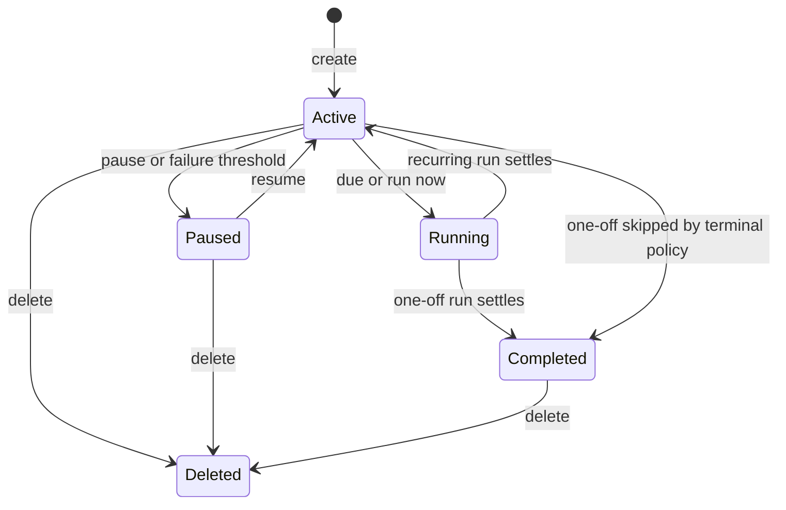

# Native scheduling: product and technical design

Status: proposed successor to `2026-08-21-scheduled-chats-design.md`
Date: 2026-09-04
Research: [scheduled AI agents and chats](../research/scheduled-ai-agents-and-chats.md)
Change control: [CR-2026-09-04-native-scheduling](../../prd/change-requests/CR-2026-09-04-native-scheduling.md)
Execution: [Phase 1](../../project/plans/P-2026-09-04-scheduled-followups.md) · [Phase 2](../../project/plans/P-2026-09-04-calendar-scheduler-board.md)

## Decision

Pulse Code owns one provider-neutral scheduling system. The same schedule can be created from
natural language, `/schedule`, thread actions, or the global board. Its trigger determines when it
runs; its destination determines where the turn lands; its execution policy determines provider
context and limits. The server persists, fires, and records it while clients observe and control it.

Do not delegate canonical state to OpenAI Tasks, Claude `/loop`, Cursor Automations, OS cron, or a
provider-specific scheduler. Those systems can inspire adapters or import/export later, but Pulse
must keep behavior identical across providers and connection modes.

## Product vocabulary

- **Schedule:** the durable instruction, trigger, destination, and execution policy.
- **Scheduled follow-up:** a schedule whose destination is an existing thread.
- **Scheduled chat:** a schedule that owns a persistent chat for independent recurring work.
- **Occurrence:** one due instant for one schedule destination.
- **Run:** the recorded attempt or disposition for an occurrence: deferred, started, completed,
  failed, skipped, or cancelled.
- **Catch-up:** a run started after its due instant because the host was unavailable.

Avoid “soft schedule” in user-facing copy because it implies approximate delivery. The feature may
be conversational, but its timing and state are explicit.

## Scope

### Phase 1

- Exact one-off triggers.
- Existing-thread destinations.
- Explicit fresh/resume context policy.
- `/schedule` and thread action on web and mobile.
- Shared schedule draft and confirmation.
- Thread-scoped Pulse MCP tools for proposing and creating schedules.
- Completed one-off state and visible missed/overlap disposition.

### Phase 2

- Calendar recurrence backed by RFC 5545 RRULE.
- Daily, weekdays, weekly, monthly, quarterly, annual, and custom presets.
- Global cross-environment scheduler board.
- Paginated immutable run history.
- Unread results and notification hooks.
- Host health, exact next run, and Needs attention states.

### Deferred

- App-event triggers.
- Multi-step workflow graphs and run chaining.
- Provider-native schedule synchronization.
- Arbitrary deterministic shell commands.
- Team assignment and shared ownership.
- Per-tool policy and spend caps, which need a separate guardrails design.

## User journeys

### Schedule from a thread

1. The user says “retry this tomorrow at 08:00” or chooses `/schedule`.
2. Pulse opens a draft prefilled with the current thread, instruction, resolved absolute time, and
   `Africa/Johannesburg` or the user's selected IANA timezone.
3. If recurrence is absent, Pulse infers **Once** when the utterance contains a single date. If the
   wording is only “at 08:00,” it asks **Should this run once or repeat?**
4. The card shows destination **This thread**, context **Resume this work**, and the next exact run.
5. The user creates the schedule. Pulse returns a schedule ID and a link to the board.
6. At the due instant, the server waits for the thread to become available, adds the instruction as
   an ordinary user turn, and records whether the start was on time or caught up.
7. Completion appears in the thread and the schedule moves to Completed.

### Create a recurring scheduled chat

1. The user opens Scheduled and selects **New schedule**.
2. They enter an instruction, choose a project or project set, and select Weekly, Quarterly, or
   Custom.
3. Pulse previews the next three occurrences in local time.
4. Each fire runs in the schedule-owned thread. Fresh context remains the default, with the existing
   handoff file carrying bounded continuity.
5. The board shows next run, last result, host state, and unread output.

### Agent-assisted creation

1. A user explicitly asks the active provider to schedule later work.
2. The provider calls `schedule_propose` with the interpreted instruction and timing.
3. Pulse normalizes and validates the request and returns a proposal. Ambiguity returns structured
   missing fields rather than inventing a cadence.
4. The client renders the proposal in-thread. User confirmation calls the ordinary orchestration
   command. `schedule_create` may execute directly only when the tool invocation carries explicit
   user scheduling intent under the thread's current turn.
5. The tool returns the schedule ID, normalized timezone, next occurrence, and board link.

## Domain model

### Trigger

```ts
type ScheduleTrigger =
  | {
      _tag: "once";
      at: IsoDateTime;
      timezone: IanaTimezone;
    }
  | {
      _tag: "interval";
      everyMinutes: PositiveInt;
      anchorAt: IsoDateTime;
      timezone: IanaTimezone;
    }
  | {
      _tag: "calendar";
      rrule: RRuleString;
      dtstartLocal: LocalDateTime;
      timezone: IanaTimezone;
    };
```

The interval branch preserves elapsed-time behavior. Calendar recurrence uses local wall-clock
semantics and an IANA timezone. `once.at` is stored as an instant while retaining the display
timezone used to confirm it.

`nextScheduleOccurrence(trigger, after)` and `scheduleOccurrenceWindow(trigger, from, limit)` are
pure contract helpers covered by fixed clocks. The reactor consumes those helpers; clients never
reimplement recurrence.

### Destination

```ts
type ScheduleDestination =
  | {
      _tag: "thread";
      projectId: ProjectId;
      threadId: ThreadId;
    }
  | {
      _tag: "project";
      projectId: ProjectId;
      threadPolicy: "schedule-owned";
    }
  | {
      _tag: "environment";
      projectIds: ReadonlyArray<ProjectId> | "all";
      threadPolicy: "schedule-owned";
    };
```

An existing-thread destination never changes thread ownership or origin. A schedule-owned
destination retains `schedule:<scheduleId>` origin and the current per-project thread behavior.
Environment fan-out remains one occurrence per project.

### Execution policy

```ts
type ScheduleExecutionPolicy = {
  contextMode: "fresh" | "resume";
  modelSelection: ModelSelection | null;
  maxRunMinutes: ScheduleLimitMinutes;
  maxTurnMinutes: ScheduleLimitMinutes;
  skipIfDirty: boolean;
  misfirePolicy: "run-latest" | "skip";
  overlapPolicy: "defer" | "skip";
};
```

Defaults depend on destination:

| Destination                | Context | Misfire    | Overlap | Dirty working tree          |
| -------------------------- | ------- | ---------- | ------- | --------------------------- |
| Existing thread, once      | Resume  | Run latest | Defer   | Follow project/user policy  |
| Existing thread, recurring | Resume  | Run latest | Skip    | Follow project/user policy  |
| Schedule-owned project     | Fresh   | Run latest | Skip    | Current project default     |
| Environment fan-out        | Fresh   | Run latest | Skip    | Current environment default |

Adapters that cannot resume a session return a provider capability error at creation or require the
user to select Fresh. Pulse does not claim continuity that the adapter cannot deliver.

### Lifecycle



Failure belongs to a run, not the schedule's durable lifecycle. A recurring schedule may be Active
with a failed last run or Paused after the documented failure threshold. A one-off failure remains
Needs attention and can be retried, rescheduled, or completed by the user.

## Event and projection changes

Add native create/update commands behind a reject-safe version boundary. Their events carry the
typed trigger, destination, execution policy, and `completedAt`. Existing event payloads remain
decodable and project into an interval or daily compatibility trigger.

The schedule shell projection stays compact:

- definition and lifecycle state;
- next due instant;
- one latest-run summary per destination;
- unread/needs-attention rollups;
- no unbounded run array.

The event store already contains occurrence events. Add an on-demand `getScheduleRuns` RPC that
projects a page ordered by scheduled time and stable event sequence. Its cursor must survive equal
timestamps and event replay. Pages contain identifiers, scheduled/started/settled timestamps,
trigger source, catch-up flag, state, reason, project, thread, turn, and output/checkpoint pointers.

## Mixed-version safety

An older server must not interpret a native one-off as a legacy daily schedule after dropping
unknown fields. Add optional environment capabilities:

- `nativeScheduleTriggers`;
- `scheduleThreadDestinations`;
- `scheduleRunHistory`;
- `agentScheduleTools`.

New clients send native commands only when the needed capability is true. Use new command tags for
native create/update so an old server rejects the request even if a client gate fails. Old interval
schedules continue through the legacy command path. New servers continue decoding old snapshots
and events.

The web, desktop, and mobile clients render native schedules they understand and show an update-
required state for a future trigger/destination tag rather than discarding the whole snapshot.

## Recurrence semantics

- Store timezone names, never fixed UTC offsets, for calendar recurrence.
- Validate RRULE into a supported subset: `FREQ`, `INTERVAL`, `BYDAY`, `BYMONTHDAY`, `BYMONTH`,
  `COUNT`, and `UNTIL`. Reject unbounded expansion rules or invalid combinations.
- Quarterly is `FREQ=MONTHLY;INTERVAL=3` anchored to the selected local date and time.
- Preview the next three occurrences before save and after edits.
- On daylight-saving gaps, advance to the recurrence library's next valid local instant and surface
  the resolved preview. On repeated local times, choose the earlier instant consistently.
- A one-off reaches Completed after one terminal run disposition and never fires again.
- Default catch-up starts only the latest missed occurrence. Skip records a visible run. Do not ship
  run-all backlog behavior in these phases.

Use a small, maintained RRULE dependency only if it passes bundle and correctness review. Keep it
in contracts/server code that calculates schedules; do not ship separate recurrence engines to
web and mobile.

## Reactor behavior

The sweep remains a dumb caller of pure due-occurrence helpers and orchestration commands.

1. Read the compact schedule projection.
2. Settle or leash running occurrences.
3. Ask the pure trigger helper for the next eligible occurrence after the recorded cursor.
4. Apply host, misfire, overlap, working-tree, authentication, and provider gates.
5. Record a skipped or deferred disposition when execution cannot start.
6. Resolve an existing destination thread or create the schedule-owned thread.
7. Dispatch `schedule.occurrence.start` and an ordinary `thread.turn.start` with the chosen context
   mode.
8. For a one-off, emit schedule completion after the occurrence reaches a terminal state.

Keep cross-schedule spacing from hiding delay. When spacing defers a due run, expose a delayed
reason and `eligibleAfter`; do not write a false failure or silently advance its occurrence cursor.

## MCP scheduling capability

The current provider-scoped MCP token grants only `preview`. Extend it with a separate `schedule`
capability scoped to the issuing environment and thread. Scheduling tools derive destination
identity from the credential; they do not accept arbitrary environment IDs or thread IDs.

Tools:

- `schedule_propose`: read-only normalization and ambiguity result.
- `schedule_create`: creates from a complete proposal and explicit current-turn authorization.
- `schedule_list`: lists schedules attached to the current thread.
- `schedule_cancel`: cancels a schedule attached to the current thread when explicitly requested.

Do not couple MCP credential issuance to the browser-preview setting. Each provider adapter already
receives the Pulse MCP endpoint; credential capabilities must be issued from enabled server
features. Tests cover token expiry, thread scoping, unsupported capability, replay, and absence of
credentials in logs or tool output.

## Composer and review card

`/schedule` is a Pulse built-in command on web and mobile, placed beside `/model`, `/plan`, and
`/default`. Selecting it opens the shared schedule draft instead of sending provider text.

The draft contains:

- instruction;
- Once or Repeat;
- date/time and timezone;
- recurrence preset or custom rule;
- destination: This thread or New scheduled chat;
- context: Resume or Fresh when applicable;
- project scope, provider/model, dirty-worktree behavior, and time limits in Advanced;
- normalized next occurrence and host-availability note.

The parser can live in `packages/client-runtime` only for deterministic UI conveniences. Agent
language interpretation uses the provider plus `schedule_propose`; the server always validates the
typed result. Do not introduce a second LLM call solely to parse dates.

## Scheduler board

The existing Scheduled sidebar mode becomes the entry to a full route rather than a substitute for
one. Settings can link to it and retain environment-specific advanced configuration during
migration.

The board aggregates compact schedules from connected environments and uses on-demand environment
queries for history. It offers All, Active, Paused, Completed, and Needs attention filters, plus
environment/project and cadence filters.

Each row shows name, concise instruction, cadence, next run, destination, state, last result, host
availability, and unread result. Controls are Run now, Open thread, Edit, Pause/Resume, Duplicate,
and Delete. Completed one-offs are retained until deletion.

Opening a row requests the first run-history page. Infinite loading requests later pages; it does
not expand the shell subscription. Disconnecting one environment leaves its last known rows marked
offline without blocking other environments.

## Notifications

Reuse the agent-activity publishing boundary. A schedule run may publish one bounded completion or
needs-attention event carrying schedule, environment, project, and thread identifiers. It never
publishes prompt contents, provider credentials, or diffs. Opening the linked thread marks the
result read through the existing client/server unread semantics or a small additive schedule-read
command if thread unread state cannot represent a run without a thread.

## Performance constraints

- Keep schedule shell payload proportional to schedule count, not run count.
- Compute next occurrences only when a trigger or cursor changes; cache normalized recurrence.
- Do not tick or animate countdowns continuously. Update relative labels on existing coarse UI
  clocks and show exact timestamps on demand.
- Virtualize or page global-board rows if the existing list threshold is exceeded.
- Avoid one subscription per schedule; aggregate through environment shell streams and on-demand
  detail RPCs.
- Bound MCP list results and recurrence previews.

## Remote and multi-surface behavior

- The owning server executes schedules in local, LAN, Tailscale, relay, and tunnel modes.
- Web and mobile are controllers; disconnecting them does not pause a schedule.
- A desktop-hosted server can execute while its server process is alive. Host sleep produces catch-
  up or skip according to policy and a visible run disposition.
- Web and desktop share the web composer and board. Mobile has native composer, editor, board, and
  notification navigation.
- An environment unavailable to the client remains visible from cached catalog data only when the
  existing connection model permits it; controls disable until reconnected.

## Provider decisions

| Provider | Scheduled fresh turn                | Resume existing thread                                           | Pulse MCP tools                      | Decision                     |
| -------- | ----------------------------------- | ---------------------------------------------------------------- | ------------------------------------ | ---------------------------- |
| Codex    | Existing support                    | Supported through ordinary resume semantics, verified in Phase 1 | Existing MCP wiring                  | Include                      |
| Claude   | Existing support                    | Verify adapter resume before enabling                            | Existing MCP wiring                  | Include with capability gate |
| Cursor   | Existing support                    | Verify ACP/session behavior                                      | Existing MCP wiring                  | Include with capability gate |
| Grok     | Existing support                    | Verify ACP/session behavior                                      | Existing MCP wiring                  | Include with capability gate |
| OpenCode | Existing support                    | Verify adapter resume before enabling                            | Existing MCP wiring                  | Include with capability gate |
| OMP      | Provider present on remote baseline | Verify session and MCP behavior independently                    | Do not infer from other ACP adapters | Gate until proven            |

The editor filters or disables unsupported combinations. It does not remove an entire provider when
fresh schedule-owned chats still work.

## Observability and recovery

Structured server logs include schedule ID, occurrence key, destination project/thread IDs,
scheduled/start/settled times, trigger source, result, and bounded reason. They exclude instruction
text and credentials.

The board exposes:

- server/host availability;
- last scheduler sweep or a derived health state;
- overdue active schedules;
- last failure or skip reason;
- auto-pause threshold and resume action;
- delayed-until time when spacing or an active thread defers execution.

Exactly-once tests cover double sweep, restart replay, equal timestamps, manual run races, and one-
off completion. Catch-up tests use Effect clocks and receipts, never sleeps.

## Alternatives rejected

### Call the OpenAI scheduler

Rejected because it excludes other providers, moves truth outside the environment, and creates
different remote/history behavior per provider.

### Store raw cron expressions

Rejected as the main user contract because monthly, quarterly, and timezone-aware calendar rules
need clearer semantics. Cron import can be translated into supported recurrence later.

### Send all run history in shell snapshots

Rejected because websocket payload and projection work would grow without bound across remote and
mobile clients.

### Always resume the provider session

Rejected because recurring maintenance and reports benefit from bounded fresh context, and not all
providers guarantee durable resume. Context mode belongs in the schedule policy.

### Let agents create schedules without confirmation

Rejected because future execution is a durable side effect. Explicit scheduling language can
authorize direct creation; otherwise the agent returns a proposal for review.

## Rollout

1. Land contract helpers and server capabilities with no new client entry point.
2. Enable one-off existing-thread schedules behind the advertised capability.
3. Add web and mobile `/schedule`, then the agent MCP tools.
4. Observe one-off completion, catch-up, overlap, and resume metrics before enabling recurrence.
5. Add calendar recurrence and run-history RPC.
6. Route existing Scheduled navigation to the board and add notifications.
7. Update user and internal documentation and remove temporary feature gating after mixed-version
   coverage and one release cycle.

## Success measures

- Schedule creation succeeds without correction when the user supplied an unambiguous date,
  timezone, destination, and cadence.
- No occurrence is silently lost or started twice in restart and overlap tests.
- A scheduled follow-up lands in the requested thread and preserves the selected context mode.
- One-off schedules reach Completed and remain inspectable.
- Global-board initial payload remains bounded by schedule count; history is fetched only on open.
- Web, desktop, iOS, and Android can create, inspect, pause, resume, edit, and delete the same
  canonical schedules.
- Every provider has an explicit fresh/resume/MCP capability result.

## Execution boundary

[Phase 1](../../project/plans/P-2026-09-04-scheduled-followups.md) builds the smallest complete
follow-up flow. [Phase 2](../../project/plans/P-2026-09-04-calendar-scheduler-board.md) begins only
after the trigger/destination contract and one-off runtime pass their focused gates. Event triggers
and Phase 3 guardrails require later plans.
