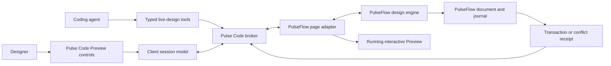

# PulseFlow Preview design controls integration plan

## Decision

Pulse Code will expose one permanent **Design** entry point in Preview. The entry point opens or resumes a PulseFlow design session. **Create mock-up** is a start action inside that menu, not a second permanent toolbar button.

An active session adds a compact control strip:

`Designing | Pick | Create | Iterate | Polish | Compare | Undo | Apply | Finish`

The strip is responsive. Narrow Preview widths retain `Designing | Pick | Actions | Apply`, with Create, Iterate, Polish, Compare, Undo, and Finish in Actions. Selection-specific commands appear beside the selected page target. PulseFlow owns the commands and document changes. Pulse Code owns the containing Preview UI, keyboard and focus arbitration, transport, and receipts.

This design keeps the common path visible without turning Preview into a second design application. It also preserves every pinned Impeccable action through the action picker and command palette.

## Goals

- Start, resume, and finish a PulseFlow design session without leaving Preview.
- Let a user browse the running product, pick stable PulseFlow targets, and exercise interactions without confusing clicks with selections.
- Preserve the full Impeccable Start, Iterate, Polish, Maintain, picker, variant, tuning, steering, and acceptance loops.
- Make speculative work safe. A generated variant cannot alter the canonical PulseFlow document until the user accepts it.
- Use the same session from visible controls, the coding agent, or supported voice input.
- Keep ordinary Preview, capture, annotations, viewport controls, and browser automation working.
- Provide exact receipts and deterministic recovery for every document-changing request.

## Non-goals

- Pulse Code will not parse or patch the PulseFlow document.
- Pulse Code will not infer document identity from CSS selectors, text, DOM position, or screenshots.
- The first release will not offer pointer-heavy authoring on mobile.
- This plan does not add a general-purpose visual editor for pages without the PulseFlow adapter.
- Generic Impeccable source rewriting remains a separate adapter and release decision.

## Chosen interaction model

### Design entry point

The Preview header shows **Design** only when Preview exists. Its state communicates availability:

| State        | Presentation               | Action                                           |
| ------------ | -------------------------- | ------------------------------------------------ |
| Checking     | Disabled spinner           | Wait for server and page capability discovery.   |
| Unavailable  | Disabled with reason       | Open diagnostics or update guidance.             |
| Ready        | Design                     | Open the start menu.                             |
| Connecting   | Design, connecting         | Show cancellable handshake progress.             |
| Active       | Designing                  | Open session details and controls.               |
| Reconnecting | Designing, reconnecting    | Show checkpoint status; disable mutations.       |
| Attention    | Designing, action required | Open the conflict, permission, or recovery card. |

The ready-state menu contains:

- **Create mock-up**, which starts a new PulseFlow document or page through the adapter.
- **Import current Preview**, which asks PulseFlow to reconstruct a document from the current page when the adapter advertises import support.
- **Open existing design**, which opens the PulseFlow-owned document chooser.
- **Resume last session**, when a compatible checkpoint exists for the current thread, environment, page, and document revision.

The menu does not promise unsupported actions. Missing capabilities are absent or disabled with a concrete reason.

### Browse, Pick, and Interact modes

The page has one explicit input mode at a time:

| Mode     | Pointer behavior                                                                                                         | Keyboard behavior                                                          | Exit                                             |
| -------- | ------------------------------------------------------------------------------------------------------------------------ | -------------------------------------------------------------------------- | ------------------------------------------------ |
| Browse   | The application receives normal input.                                                                                   | The application receives normal input except registered Preview shortcuts. | Choose Pick or end the session.                  |
| Pick     | Hover shows eligible PulseFlow targets; click selects the top eligible target.                                           | Arrow traversal may move through the semantic target tree. Enter selects.  | Escape clears selection, then returns to Browse. |
| Interact | The application receives input while Pulse Code records the interaction path and current selected target remains pinned. | Page editables retain text and composition events.                         | Escape returns to Pick or Browse.                |

Holding `Alt` temporarily enters Pick from Browse and temporarily enters Interact from Pick. Releasing it returns to the prior mode. The binding must be configurable where the operating system reserves Alt behavior.

Pulse Code chrome, annotation handles, ResizeObserver overlays, and variant controls are never pickable. The page adapter returns stable node IDs, display names, bounds, target type, allowed operations, and insertion anchors. Pulse Code never manufactures a target ID.

### Contextual selection toolbar

Once a target is selected, a floating toolbar appears near it without covering its primary content. Placement flips or docks when the target is too small or near a viewport edge.

Default actions are Iterate, Polish, Edit text, Replace, Duplicate, Hide, Annotate, and More. The adapter returns the actual command list for the selected target. Examples include:

| Target          | Additional actions                                            |
| --------------- | ------------------------------------------------------------- |
| Text            | Rewrite, shorten, expand, change tone, stage copy.            |
| Component       | Replace, duplicate, change layout, inspect states.            |
| Section         | Reorder, restructure, vary layout, change emphasis.           |
| Page            | Restyle, generate page variants, run an accessibility review. |
| Image           | Replace, crop, reposition, change treatment.                  |
| Multi-selection | Align, distribute, group, match style.                        |

Every action carries the stable target ID and current document revision. If the target disappears after hot reload, the toolbar becomes stale and offers reselect. It does not silently retarget a nearby node.

### Iterate

Iterate opens a tray bound to the current target. It contains:

- variant count from 1 through 8, default 3;
- preserve controls for content, structure, brand, and behavior;
- change controls for layout, density, hierarchy, color, typography, and motion;
- intensity of subtle, balanced, or exploratory;
- a text or supported voice steering instruction; and
- **Generate variants**.

PulseFlow streams valid variants as they become reviewable. The tray shows Original, previous, clickable dots, next, current count, generation phase, Tune, Steer, Accept, and Discard. A failed sibling does not invalidate successful variants. A mount failure exposes Retry and Dismiss and keeps Accept disabled for that variant.

Each variant has an ephemeral document revision. Previewing it can run its real interactions. It cannot mutate the canonical document. Accept sends the exact session, target, variant, ephemeral revision, base document revision, parameter values, and idempotency key.

### Polish

Polish keeps product intent and exposes focused passes:

- hierarchy;
- spacing;
- typography;
- color;
- responsive behavior;
- accessibility;
- interaction and motion; and
- full polish.

The selected pass uses the same variant lifecycle as Iterate. A polish result is still speculative until accepted. Maintain commands remain available under More and the Impeccable skill picker so cleanup, consistency, and design-system alignment are not collapsed into visual polish.

### Apply, Accept, Undo, and Finish

**Apply** is used for staged copy and manual edits. **Accept** is used for a generated variant. Both create PulseFlow-owned atomic transactions and return a transaction receipt. The UI must use those verbs consistently.

Undo and Redo ask PulseFlow to operate on accepted transaction IDs. They are not DOM history. If another actor changes the document, PulseFlow may reject undo with a typed conflict and a rebase path.

Finish ends live-only state, keeps ordinary Preview open, and offers the PulseFlow-generated handoff or output. Stopping a session with unaccepted work prompts the user to discard it or continue designing.

## Architecture



### Package ownership in Pulse Code

The implementation should follow repository boundaries discovered during delivery rather than force these provisional names, but the responsibilities are fixed:

| Area              | Responsibility                                                                                                                   |
| ----------------- | -------------------------------------------------------------------------------------------------------------------------------- |
| Contracts package | Capability, handshake, command, event, error, and receipt schemas with runtime validation.                                       |
| Server broker     | Authorization, tab and environment binding, idempotency, sequence enforcement, reconnect, bounded transport, and audit metadata. |
| Web Preview       | Design entry point, mode state, responsive toolbar, trays, contextual toolbar, status, conflict, and recovery UI.                |
| Desktop host      | Local webview bridge, origin isolation, focus and shortcut coordination, and capture boundaries.                                 |
| Agent tools       | Narrow start, status, target, generate, steer, tune, accept, discard, undo, redo, and stop operations.                           |
| Mobile            | Read-only session status plus a deep link or handoff to a capable host.                                                          |

### Session identity

Every message carries:

```ts
type LiveDesignEnvelope = {
  protocolVersion: "1";
  environmentId: string;
  threadId: string;
  previewTabId: string;
  sessionId: string;
  pageId: string;
  documentId: string;
  documentRevision: string;
  adapterOrigin: string;
  navigationNonce: string;
  serverEpoch: string;
  sequence: number;
};
```

Mutation-like commands also require `actorId`, `permissionRevision`, and `idempotencyKey`. The client may project state from events, but a broker status response remains authoritative after reconnect or an uncertain result.

### Client state machine

```text
unavailable
  -> ready
  -> connecting
  -> browsing | picking | interacting
  -> generating -> reviewing
  -> applying -> browsing
  -> reconnecting -> reconciling -> prior safe phase
  -> stopping -> ready
```

Conflict, permission-denied, adapter-mismatch, and mount-failed are explicit substates with bounded recovery actions. The client must reject regressing phase numbers, duplicate terminal events, events from an old navigation nonce, and results for another tab.

## Protocol additions

Extend `PreviewLiveDesignCapability.operations` with `createMockup`, `importPreview`, `openDocument`, `undo`, `redo`, `compare`, and `finish`. Capability negotiation remains additive. Older servers omit operations and newer clients hide their controls.

Add typed commands for:

- session start, resume, status, stop, and finish;
- input-mode change and target selection;
- mock-up creation, Preview import, and existing-document selection;
- variant generation, parameter tuning, steering, comparison, acceptance, and discard;
- staged text or manual edit apply and discard;
- transaction undo and redo; and
- mount retry, recovery reconciliation, and diagnostic collection.

Errors use stable codes such as `capability_missing`, `adapter_mismatch`, `origin_changed`, `target_stale`, `revision_conflict`, `permission_denied`, `variant_invalid`, `mount_failed`, `gateway_required`, `result_uncertain`, and `payload_too_large`. Human messages remain presentational and are not used for control flow.

## Security and isolation

- Accept messages only from the exact navigated origin after a nonce-bound handshake.
- Invalidate the binding on navigation, origin change, tab transfer, server epoch change, or environment reconnect.
- Authorize every operation on the server. Hiding a button is not authorization.
- Bound message size, variant metadata, annotation images, event rate, and pending request count.
- Redact console, network, screenshot, and prompt evidence before it enters agent context or receipts.
- Never expose a raw remote dev-server port. Public environments require the authenticated Preview gateway.
- Keep host overlays outside the page's pickable tree and isolate styles, pointer capture, and keyboard listeners.
- Reconcile an uncertain mutation by idempotency key before enabling another mutation.

## Accessibility and input

- Every control must be reachable by keyboard and expose an accessible name, pressed state, disabled reason, and shortcut where applicable.
- Selection outlines cannot rely on color alone. Use stroke shape and a label.
- Focus returns to the initiating control when a tray or dialog closes.
- The action toolbar docks into a reachable region when spatial placement would trap or obscure it.
- Screen readers receive concise announcements for selection, generation progress, variant arrival, failure, acceptance, and conflict.
- Reduced-motion preference disables animated transitions while preserving state changes.
- Pointer, touch, pen, keyboard, and composition input must not leak across Browse, Pick, and Interact modes.

## Observability and privacy

Emit structured events for capability result, handshake latency, session start, mode change, selection success or stale target, first reviewable variant, generation completion, mount failure, accept outcome, reconciliation, undo, and finish. Do not log prompts, page text, screenshots, document content, or provider credentials by default.

Operational measures include session-start success, time to first pick, time to first reviewable variant, accept success, uncertain-result rate, reconnect recovery, stale-target rate, and escape-from-mode failures. Product metrics need an explicit analytics and privacy review before collection.

## Delivery slices

### Slice 0: contract fixture and compatibility lock

Build a deterministic PulseFlow adapter fixture that advertises every pinned command, live action, UI surface, event, phase, and parameter kind. Add a registry parity test shared through a checked fixture or generated artifact. Completion requires old client/new server and new client/old server tests.

### Slice 1: local host proof

Open a real local PulseFlow page in Preview. Complete the handshake, bind the tab, switch Browse and Pick, select a stable node, and read session status. No mutation ships in this slice.

### Slice 2: session shell and mock-up entry

Add Design states, start menu, Create mock-up, Open existing design, responsive toolbar, Stop, Finish, and typed unavailable states. Import current Preview stays capability-gated until PulseFlow proves reconstruction quality and provenance.

### Slice 3: picker and interaction arbitration

Add target overlays, contextual actions, multi-selection when advertised, insertion anchors, Browse/Pick/Interact, Alt inversion, Escape unwinding, editable focus rules, host-chrome exclusion, and stale-target recovery.

### Slice 4: Iterate and Polish

Add the Iterate tray, Polish passes, progressive variant row, compare view, parameters, Tune, text or supported voice Steer, partial failure, mount recovery, and speculative interactive previews.

### Slice 5: transactions and Maintain

Add Accept, staged edit Apply, Discard, undo, redo, idempotency reconciliation, conflict cards, transaction receipts, DESIGN.md Visual and Raw views, and the remaining Maintain actions through the picker.

### Slice 6: agent and evidence integration

Expose narrow agent tools, preserve Impeccable skill discovery, bind captures and annotations to the current session and target, and add redacted evidence references to receipts.

### Slice 7: private and public remote support

Verify private-network routing and reconnection. Implement the authenticated Preview gateway for public or relay-only environments, then run a security review covering origin binding, authorization, rate limits, byte limits, expiry, and revocation.

### Slice 8: release and mobile handoff

Ship behind a server capability and client feature flag. Mobile shows read-only status and a handoff link. Remove the flag only after local, private, and public matrices meet their release gates.

## Test plan

### Contract tests

- Round-trip every command, event, receipt, and error schema.
- Reject unknown required fields, invalid counts, more than four parameters, invalid sequences, stale nonce, wrong tab, wrong origin, and oversized payloads.
- Prove additive capability skew in both directions.
- Pin the audited Impeccable registry and fail when an upstream value lacks a mapping or waiver.

### Client tests

- Cover every Design button state and responsive collapse.
- Cover Browse, Pick, and Interact pointer and keyboard routing.
- Cover contextual actions by target type, stale target, toolbar docking, and screen-reader announcements.
- Cover progressive variants, comparison, parameters, Tune, Steer, partial failure, mount failure, Accept, Apply, Discard, Undo, Redo, and Finish.
- Prove duplicate clicks and delayed old-session events cannot cause a second mutation.

### Broker and security tests

- Reject cross-user, cross-thread, cross-environment, cross-tab, cross-origin, expired, and replayed messages.
- Reconcile disconnects before allowing another mutation.
- Enforce permission and document revision changes between generation and acceptance.
- Exercise backpressure, cancellation, rate limits, byte limits, and redaction.

### End-to-end matrices

- Run web and desktop against local PulseFlow, a reachable private environment, and the authenticated public gateway.
- Chrome, Chromium webview, viewport presets, light and dark appearance, reduced motion, keyboard-only, and screen reader smoke paths.
- Hot reload during selection, generation, review, and acceptance.
- Existing Preview screenshots, recording, annotations, refresh, pop-out, and browser automation while a design session is active.

## Release gates

- A registry parity report covers every pinned Impeccable command and interactive item or records an approved waiver.
- The full local happy path works against PulseFlow, not only the fixture.
- Accept, Apply, Undo, and Redo have exactly-once tests across disconnect and retry.
- No host chrome can be selected or included in a PulseFlow document operation.
- Accessibility checks pass for keyboard navigation, focus, names, states, announcements, contrast, and reduced motion.
- Security review approves the gateway before public remote support is advertised.
- Mobile copy states that authoring requires web or desktop.
- PulseFlow and Pulse Code protocol versions, fixtures, and compatibility policy are published together.

## Rollback

The capability and feature flag can disable new session starts without disabling ordinary Preview. Active sessions may finish or stop, but a kill switch can force read-only reconciliation if a transaction or security defect appears. Protocol fields remain additive so rollback does not require document migration.

## Dependencies and sequencing

PulseFlow must deliver stable node identity, the page adapter, ephemeral document revisions, variant mounting, atomic transactions, undo, journal receipts, and the shared registry fixture. Pulse Code can build contracts, the deterministic fixture, session shell, and local handshake in parallel, but the real end-to-end release gate waits for those PulseFlow capabilities.

The authenticated gateway is the only hard blocker for public remote environments. Local desktop remains the first shippable path. Private-network support follows after routing and reconnect verification.

## Estimate

The Pulse Code portion remains 6 to 9 engineering-weeks for an experienced team, excluding PulseFlow engine work. A reasonable allocation is:

| Work                                              | Engineering-weeks |
| ------------------------------------------------- | ----------------: |
| Contracts, fixture, compatibility tests           |               1.0 |
| Broker, identity, idempotency, reconnect          |        1.0 to 1.5 |
| Preview shell, modes, picker, accessibility       |        1.5 to 2.0 |
| Variants, Polish, comparison, receipts            |        1.5 to 2.0 |
| Agent tools, evidence, private-network validation |        0.5 to 1.0 |
| Public gateway and security verification          |        0.5 to 1.5 |

This is a planning judgment. The range assumes the existing Preview and broker abstractions can accept additive live-design contracts without refactoring their ownership boundaries.

## Definition of done

A designer can open a real PulseFlow project in Pulse Code, start from Create mock-up or an existing document, pick a stable target, switch to Interact to exercise it, generate and compare variants, tune or steer one, run a focused Polish pass, accept exactly one atomic document transaction, undo it, and finish the session. The workflow works on local desktop, preserves ordinary Preview tools, survives reload and reconnect, reports typed failures, and demonstrates registry parity with the pinned Impeccable version. Public remote support is done only when the authenticated gateway passes its security gate.

## Related product artifacts

- [PulseFlow Live Design in Pulse Code](../../prd/16-pulseflow-live-design.md)
- [PulseFlow live design acceptance criteria](../../prd/20-acceptance-criteria/pulseflow-live-design.md)
- [Run a PulseFlow live-design session](../../workflows/run-pulseflow-live-design.md)
- [Preview live-design host tool flow](../../tool-flow/pulseflow-live-design.md)

---

**Created:** 2026-09-04 . **Last opened:** 2026-09-04 . **Last edited:** 2026-09-04 . **Status:** approved plan . **Owner:** Product and Engineering . **Layer:** tactical
