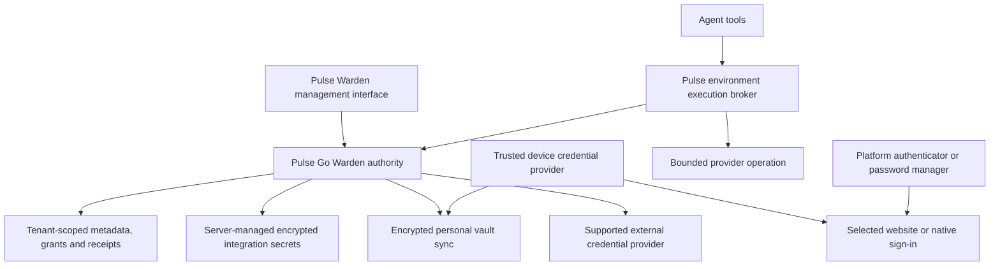

# Pulse Warden integration review

Historical authoring evidence. Forward requirements live in [Pulse Warden PRD](../../prd/17-pulse-warden.md) and the separate Pulse Go §29.

Date: 2026-09-07. Status: architecture review proposal. The owner confirmed Bitwarden / Vaultwarden first, then Pulse-managed passwords and native passkeys, with full Pulse product branding and commercial use as long-term requirements. Detailed architecture is not yet an approved spec or implemented capability.

This review expands the August 30 Warden map to cover Pulse Go and Pulse Office/Code, browser passwords, server integrations, agents, and passkeys. It does not replace the existing canonical map or mark its rollout gates complete. Incorporate agreed changes into that map and the product specifications before implementation.

## What exists

| Evidence                                                                                                                                                                                    | Finding                                                                                                                                                 |
| ------------------------------------------------------------------------------------------------------------------------------------------------------------------------------------------- | ------------------------------------------------------------------------------------------------------------------------------------------------------- |
| External repository `F:/Dev Ops/pulse-go`, `project/decisions.md`, section Pulse Warden                                                                                                     | Owner chose one broker and one interface. Product name is Pulse Warden; Pulse Vault is the older name.                                                  |
| External repository `F:/Dev Ops/pulse-go`, branch `feat/beat-external-read-port`, commit `05782652a565df8ae2d1264c26e7137505eae393`, `docs/plans/2026-08-30-pulse-warden-credential-map.md` | Tenant-owned broker in pulse-go; four proposed tables; read-only GitHub App proof first.                                                                |
| Same branch, `prd/29-pulse-warden.md`                                                                                                                                                       | Referenced future spec is absent. No Warden Go implementation found in the inspected main and Beat checkouts.                                           |
| External repository `F:/Dev Ops/pulse-go`, `project/state/shards/roadmap.yaml`, `R-broker-credential-vault`                                                                                 | Shaped item, with Beat external-read change approval recorded as a prerequisite. Local records do not prove current remote approval or merge status.    |
| External repository `F:/Dev Ops/pulse-go`, `internal/crypto/aesgcm.go`                                                                                                                      | Existing AES-256-GCM helper uses one configured key, fresh nonces, and no associated data. Per-tenant envelope keys are not implemented by this helper. |
| External repository `F:/Dev Ops/pulse-code`, `docs/research/ai-workforce-arena/pulse-agent-framework-strategy.md`                                                                           | Older Pulse Vault strategy still assigns environment ownership and multiple credential views. August 30 map explicitly lists required amendments.       |
| `apps/server/src/auth/ServerSecretStore.ts`                                                                                                                                                 | Existing environment secret files are filesystem-protected. This is not an encrypted multi-tenant vault.                                                |
| `apps/desktop/src/preview/BrowserSession.ts`                                                                                                                                                | Persistent browser partitions exist. Their cookies and sessions are credential-bearing state; they are not password storage or passkey management.      |
| `docs/plans/2026-09-06-pulse-product-structure-reference.md`                                                                                                                                | Office and Code share connections, tasks, identities, and agent execution; the owning environment remains explicit.                                     |

The August plan is a delegated integration broker. A full password manager requires additional client encryption, unlock, recovery, autofill, sync, and native credential-provider work.

## Architecture choices

| Approach                 | Benefit                                                                                  | Cost and limitation                                                                                                    |
| ------------------------ | ---------------------------------------------------------------------------------------- | ---------------------------------------------------------------------------------------------------------------------- |
| Existing managers only   | Keep established password/passkey storage and recovery; Pulse concentrates on delegation | Capabilities depend on each manager's supported API. Cannot promise universal autofill or arbitrary passkey export.    |
| Fully Pulse-managed      | Consistent product and ownership model across all clients                                | Largest implementation and review burden: encryption lifecycle, recovery, extensions, native providers, compatibility. |
| Both, integrations first | Deliver the broker while progressively adding Pulse-managed credentials                  | Must label storage authority and supported operations clearly. Selected by the owner on 2026-09-07.                    |

Vaultwarden is a possible external human password-manager choice, not the name of Pulse's broker. Its upstream identifies it as a Bitwarden Client API implementation. Bitwarden Secrets Manager is a separate product with machine-oriented integration APIs. Do not assume interchangeable APIs or repeat the earlier rejected machine-account integration without a capability proof. See [Vaultwarden upstream](https://github.com/dani-garcia/vaultwarden) and [Bitwarden Secrets Manager](https://bitwarden.com/help/secrets-manager-overview/).

## First integration: Bitwarden / Vaultwarden

Owner selected Bitwarden / Vaultwarden on 2026-09-07. Verification in this review is against primary documentation, not a running account. Neither `bw` nor `bws` was found on the current shell's PATH. No vault was opened, extension installed, account changed or browser launched.

| Path                                        | Verified upstream behavior                                                                                                   | Pulse implementation disposition                                                                                                                                                 |
| ------------------------------------------- | ---------------------------------------------------------------------------------------------------------------------------- | -------------------------------------------------------------------------------------------------------------------------------------------------------------------------------- |
| Existing browser extension                  | Bitwarden documents user-selected password autofill and passkey use in its extension                                         | First supported browser workflow. The existing manager owns save/update, unlock, account selection and signing.                                                                  |
| Self-hosted clients                         | Bitwarden clients accept a custom server; Vaultwarden implements the compatible client API                                   | Support an explicit server type and origin. Verify a pinned client/server pair before claiming Vaultwarden compatibility. Never switch the user's existing CLI profile silently. |
| Public API                                  | Organisation management: members, collections, groups, events and policies                                                   | Not the API for fetching login passwords or using passkeys.                                                                                                                      |
| Password Manager CLI / Vault Management API | Vault data requires unlock; the session key decrypts accessible vault data. The management API runs through local `bw serve` | Optional trusted-device bridge proof, not a remotely exposed API or a provider-issued single-item lease.                                                                         |
| Secrets Manager                             | Separate product with machine accounts and access tokens                                                                     | Optional distinct adapter for unattended secrets. Selecting Bitwarden Password Manager does not opt the user into this product.                                                  |
| Vaultwarden machine delegation              | Maintainers' July 2026 discussion rejects adding Secrets Manager                                                             | No assumed machine-account endpoint. Use Warden-managed service credentials or an explicitly isolated local bridge if the proof succeeds.                                        |
| Embedded Electron extension                 | Electron supports only part of Chrome's extension API                                                                        | Do not promise the stock Bitwarden extension works in Pulse's embedded browser. External-browser handoff first; embedded support needs its own proof.                            |

Sources: [Bitwarden browser autofill](https://bitwarden.com/help/auto-fill-browser/), [custom client environments](https://bitwarden.com/help/change-client-environment/), [Password Manager APIs](https://bitwarden.com/help/bitwarden-apis/), [Password Manager CLI](https://bitwarden.com/help/cli/), [Secrets Manager machine accounts](https://bitwarden.com/help/machine-accounts/), [Vaultwarden maintainer discussion](https://github.com/dani-garcia/vaultwarden/discussions/7457), and [Electron extension support](https://www.electronjs.org/docs/latest/api/extensions).

### First browser workflow

1. In Warden connection setup, select Bitwarden-hosted, self-hosted Bitwarden, or Vaultwarden. Store the server origin, user-supplied label, ownership and mode. Configuration alone is not proof of authentication or availability.
2. Choose the browser/device that owns the sign-in. Pulse opens the approved destination in that browser after explicit user action. Use normal HTTPS navigation, not an invented extension RPC or undocumented vault-item deep link.
3. The user unlocks the installed manager and chooses the password or passkey in its own UI. Saving a new password or updating one also stays in that UI.
4. Pulse records only what it can observe: handoff requested, cancelled, or returned. User-reported completion is labeled as such. Do not claim successful authentication, the credential used, or a completed Warden grant from a page launch alone.
5. Any follow-up agent work requires separate authenticated-session authorization. A session in the user's external browser does not automatically appear in the environment's remote or embedded browser. Do not copy cookies to make that appear seamless.

This initial adapter is an external-manager handoff, with `vaultRead`, `embeddedFill`, `agentDelegate` and `unattendedUse` unavailable until their individual proofs pass. It cannot revoke an external password, erase manager copies, or audit actions performed outside Pulse. Disconnect removes the Pulse association and any Pulse grants; it does not claim to revoke Bitwarden sessions.

### Bounded delegation proof

Prototype a device-side CLI adapter only in disposable state using a dedicated test account containing synthetic entries. Use an isolated CLI data directory and fixed argument arrays; do not run generic shell commands containing credentials. The trusted device mediates unlock without routing it through chat or a recorded terminal.

The bridge may resolve an explicitly selected item ID into a trusted operation after checking Warden's request binding. Do not expose `bw` itself, vault export, unrestricted list/get, or `BW_SESSION` to agent tools. Keep the session in the bridge's private execution context and clear/lock on timeout or disconnect. Avoid `bw serve` in the initial implementation; it adds a broad HTTP interface that this bridge does not need.

Filtering requests in Pulse narrows ordinary use but does not narrow the underlying CLI session's decryption authority. A separate OS identity or equivalent process/file isolation is required to protect it from a same-user coding agent. If that boundary cannot be demonstrated, ship human handoff only and leave agent delegation unsupported for this adapter. Do not persist the master password in Pulse Go to enable unattended work.

The first proof must cover lock/cancel, wrong item, wrong tenant/device, navigation change, bridge restart, expired/replayed grant, accidental logging, and attempted direct CLI/session access by the worker. A browser password can reach only the approved form through the trusted bridge. A passkey continues through Bitwarden's browser/native provider; do not assume the Password Manager CLI offers a supported assertion API.

The release evidence records exact client/server/browser versions and separates documented support, tested support and unsupported operations. Test Bitwarden and Vaultwarden independently. Initial human handoff and subsequent managed delegation are separate milestones, so the former cannot be reported as completion of the latter.

## Commercial use and full Pulse branding

**Confirmed owner requirement, 2026-09-07:** use Vaultwarden and Bitwarden initially while preserving a fully Pulse-branded commercial product long term. Commercial use does not imply a closed-source fork or permission to remove required legal notices. Keep the existing open-core direction; do not change Pulse Code's MIT licence as part of integration work.

### Component choices

| Component                    | Implementation rule                                                                                                                                                                                                                                                                               |
| ---------------------------- | ------------------------------------------------------------------------------------------------------------------------------------------------------------------------------------------------------------------------------------------------------------------------------------------------- |
| Vaultwarden                  | Use as a separately deployed human password-vault backend where selected. Track its AGPLv3 obligations for distribution and modifications, including the source offer required for users interacting with a modified network service.                                                             |
| Existing Bitwarden clients   | Initial users may use their installed clients. Their upstream branding remains visible during handoff; do not describe this phase as a fully rebranded password manager.                                                                                                                          |
| Future Pulse clients         | Build Pulse-owned UI, browser extension and native credential providers. Reuse eligible open-source components only after checking their exact licences and transitive dependencies. A GPL client fork remains a GPL-covered deliverable where applicable.                                        |
| Bitwarden commercial modules | Exclude from the default reused-code/build path. The checked licence limits use to internal non-production development/testing and restricts redistribution, competing products and trademark removal. Additional written rights would be a separate option, not a prerequisite baked into Pulse. |
| Pulse Go Warden              | Keep customer delegation, grants, approvals and receipts in our Go implementation. Vaultwarden does not become a machine-secret broker simply because it stores human credentials.                                                                                                                |
| Protocol and migration       | Keep upstream APIs behind a versioned adapter. Pulse records use internal IDs plus provider references. An upstream provider must be replaceable without rewriting task, policy or audit ownership.                                                                                               |

For the initial Vaultwarden-backed human vault, reuse its encrypted storage/sync rather than introduce a second copy of those items in Pulse Go. Future Pulse clients can target that backend through the adapter once compatibility is proved. The architecture's personal-sync box is a logical responsibility, not a commitment to build duplicate sync infrastructure. A later Pulse-owned backend would need explicit migration and key-compatibility proofs. Keep server-managed integration secrets on the Warden path.

### Licence evidence and limits

Vaultwarden's [AGPLv3 licence](https://github.com/dani-garcia/vaultwarden/blob/main/LICENSE.txt) and eligible Bitwarden components' [GPLv3 licence](https://github.com/bitwarden/clients/blob/main/LICENSE_GPL.txt) allow charging for compliant covered software. They preserve recipients' rights and require applicable source, copyright and licence notices. The separate [Bitwarden commercial-module licence](https://github.com/bitwarden/clients/blob/main/LICENSE_BITWARDEN.txt) is not interchangeable with GPL permissions. Check licence coverage file by file, including SDKs, mobile repositories, assets, generated bundles and bundled web-vault code.

Our product names, icons, colours, copy, domains and package IDs can be Pulse-owned. Retain required legal notices and source-access links; replacing product branding does not erase provenance. Bitwarden's [trademark guidelines](https://github.com/bitwarden/server/blob/main/TRADEMARK_GUIDELINES.md) distinguish open-source copyright rights from trademark permission. Do not reuse its logos, imitate its protected product styling, or imply endorsement. Compatibility references must be factual. This review is not trademark clearance for the name Pulse Warden.

A separate process/API boundary is the intended architecture and helps keep ownership clear. It is not a blanket legal finding that copyleft can never apply to a combined deliverable. Before distributing a fork or linking copied code into Pulse, review the actual build and packaging arrangement. We have not yet selected or cleared a fork commit or complete dependency tree.

### Required release evidence

1. Pin the exact Vaultwarden, client and SDK versions used; record source URLs, file-level licence coverage, modifications and dependency inventory.
2. Make the commercial build exclude restricted modules and unlicensed branding assets. Check its emitted artifacts, not just its source directories.
3. For covered forks, ship the required notices and corresponding source/build materials and provide the applicable network source offer. Do not label copied GPL/AGPL code MIT.
4. Audit visible branding across onboarding, unlock, autofill, passkey prompts, recovery, notifications, email templates, extension listings and native settings. Required legal notices are an explicit exception to product rebranding.
5. Use Pulse-owned signing keys, app/extension IDs, store listings, update feeds and support links. Changes to application identity and associated domains require passkey/autofill compatibility tests; a brand change is not merely CSS.
6. Verify encrypted-data portability and restore before backend/client replacement. Never promise migration of every passkey until the selected formats and providers have passed a transfer or re-enrollment proof.

Full Pulse branding is the target for Pulse-distributed clients and services. Independently installed Bitwarden clients and operating-system authentication sheets retain their own identity. This requirement changes the long-term client and packaging plan; it does not authorize removing upstream notices or shipping restricted code.

## Ownership and components

Pulse Go owns tenant policies, delegation, revocation, audit, and hosted encrypted sync. It does not own Pulse Code's task database. Pulse Code owns environment execution, local browser targets, run cancellation, and typed receipts linking back to Warden.

Keep the broker inside the existing Go API and worker initially. Put policy decisions and credential resolution behind one `internal/warden` package. Provider adapters own protocol details. Do not introduce a separate broker service merely to wrap calls; introduce process separation where an actual shared-host trust boundary requires it.

Use three declared storage modes within one product:

1. **User-unlocked.** Passwords, recovery codes, optional TOTP seeds, and Pulse-managed passkey material are encrypted on trusted clients. The sync server holds ciphertext. Unattended server access is unavailable unless the owner explicitly creates a separate managed delegation.
2. **Server-managed.** OAuth refresh tokens, API credentials, mailbox app passwords, GitHub App material, and dedicated service identities can be decrypted by the authorized broker. This enables scheduled work and is not zero-knowledge storage.
3. **Externally managed.** Warden holds provider/account references and supported capabilities. The existing manager or authenticator remains the storage authority. Unsupported actions have an explicit result rather than a silent export fallback.

Machine bootstrap identities remain outside the customer vault. Keep environment pairing keys and the Pulse platform connection identity in their existing narrow store. Keep the orchestrator's OpenBao role separate. Self-hosting the Go authority remains possible; standalone Pulse Code must keep its existing integrations usable without a mandatory hosted account. Local-only managed vault operation would require a separate explicit scope decision, not an invented tenant or silent cloud upload.

## Capability coverage

| Capability                  | Required behavior                                                                                                                                                                    |
| --------------------------- | ------------------------------------------------------------------------------------------------------------------------------------------------------------------------------------ |
| Password lifecycle          | Create, generate, save, update, rename, search, reveal/copy after unlock, delete, restore within declared retention, export/import with preview and duplicate handling.              |
| Browser saving              | User chooses account and vault, sees the actual origin, confirms save/update, and can choose never-save for a site. Capture only credential fields, never a general form transcript. |
| Autofill                    | Match validated origin and frame; account chooser; recheck navigation immediately before fill; no automatic submission. No broad suffix or arbitrary regex matching.                 |
| Browser profiles            | Separate personal and delegated profiles. Show which environment owns a remote browser. Destroy attempt-local sessions on completion/cancel where policy requires it.                |
| Integrations                | OAuth first where supported; token health, refresh, scope inspection, reconnect, rotation, revoke and disconnect. Mail/CRM/calendar operations use the same policy path.             |
| Agent access                | Request a named action on a named resource for a task attempt. Return a bounded result and receipt, not a general secret lookup.                                                     |
| Scheduling                  | Fresh grant per occurrence, explicit service identity, bounded action budget, independent approval policy. A locked personal vault does not silently unlock for jobs.                |
| Human sharing               | Separate personal and organisation ownership; collection membership; explicit transfer; remove member; rotate shared credentials when needed.                                        |
| Passkeys for Pulse login    | Pulse acts as a relying party, storing public credential records. Register, list, label, remove, and recover account access.                                                         |
| Passkeys for other services | Existing authenticator integration first; Pulse-owned keys require native credential-provider support, encrypted sync, and verified registration/assertion flows.                    |
| TOTP and recovery           | Optional vault items; generating a code is a separate capability. Do not equate storing a password with permission to use its second factor.                                         |
| Device lifecycle            | Enroll, unlock, lock, revoke, rotate device wrapping keys, recover lost device, and show sync/last-seen state.                                                                       |
| Audit                       | Who requested, who approved, action, target, policy version, environment, task/attempt, outcome, expiry, revocation progress. Export redacted history.                               |

## Browser and passkey implementation

The Pulse web app can manage Warden and authenticate its own origin. It cannot autofill arbitrary unrelated tabs by itself. External browsers need a browser extension or an existing password manager. Desktop's embedded browser needs a trusted main-process credential bridge. Mobile needs OS integration, not a React Native screen pretending to be a credential provider.

For desktop saving, an isolated preload detects supported credential forms only after user opt-in. It sends a narrowly typed proposal through a dedicated, non-transcribed channel. The trusted broker verifies frame origin, tab, profile, and navigation generation. Confirmation encrypts the value into the selected vault. Browser automation, screenshots, network capture, session replay, crash telemetry and generic tool logging must not capture that channel.

For filling, the trusted broker resolves the selected entry after unlock or scoped approval. It delivers only the needed fields to the verified frame. A password necessarily becomes available to the target page. An isolated script context does not make the shared DOM secret; see [Chrome content scripts](https://developer.chrome.com/docs/extensions/develop/concepts/content-scripts).

Do not expose `secret.get` to agents. A dedicated `browser.signIn` operation can perform a sign-in and return session status. This only protects against extraction if the agent lacks unrestricted evaluation, debugging, cookie export, network interception, shell access to the browser host, and direct access to the broker's memory/files. Ordinary local coding agents often have those privileges. Label that mode accurately. Strong delegated isolation needs a constrained browser process and tool allowlist.

External extension-to-device communication needs an authenticated pairing protocol and replay protection, not trust in an extension ID alone. Chromium explicitly warns that native messaging alone is not a secure channel against local impersonation; see [Chromium extension security FAQ](https://chromium.googlesource.com/chromium/src/+/main/extensions/docs/security_faq.md).

Passkeys have two distinct implementations:

- Pulse account sign-in uses a maintained WebAuthn relying-party implementation. Validate challenge freshness, expected origin and RP ID, user presence/verification requirements, credential ownership, and replay. Treat counter changes according to authenticator/backup behavior rather than assuming every synced key has a strictly increasing counter.
- A Pulse password manager acting as an authenticator generates and protects private keys on trusted devices and signs requests for the requesting relying party. Support an explicit OS/browser matrix. Android exposes provider integration on Android 14 and higher; Apple uses AuthenticationServices credential-provider APIs. These require native code and entitlements. See [Android provider guide](https://developer.android.com/identity/sign-in/credential-provider) and [Apple AuthenticationServices](https://developer.apple.com/documentation/AuthenticationServices).

Do not use virtual test authenticators as the production passkey implementation. Chrome's `webAuthenticationProxy` targets remote WebAuthn redirection and is not a universal password-manager API. See [Chrome API scope](https://developer.chrome.com/docs/extensions/reference/api/webAuthenticationProxy).

WebAuthn authenticates a relying-party request; it is not a generic API for retrieving a private key. Cross-device transfer, third-party passkey import/export, and embedded Electron support need platform-specific proofs. User verification must remain real; agent approval is not biometric verification. See [WebAuthn specification](https://www.w3.org/TR/webauthn-3/).

Deleting a local passkey item does not necessarily unregister it from the website. Offer separate remove-from-vault and manage-at-site actions. Avoid stranding a user without a recovery method. Sharing a passkey also shares the represented identity; prefer service-supported individual accounts and delegated roles.

## Key management and recovery

For server-managed credentials, add versioned per-tenant data keys wrapped by a separately managed root key. Authenticate tenant ID, credential ID, purpose and format version as associated data. Store wrapping versions and support resumable rotation. A compromised process-wide wrapping key or privileged broker process can still expose multiple tenants; per-tenant keys alone do not remove that risk.

For user-unlocked vaults, separate account authentication from decryption. Use a reviewed client key hierarchy and OS-protected device wrapping keys. If password unlock is selected, specify a reviewed KDF and measured parameters during the crypto design slice. Passkey authentication does not automatically produce a vault encryption key. PRF-based unlock is an optional capability only after compatibility and fallback tests.

Define recovery before storing real credentials. User-unlocked recovery needs an enrolled device, owner-held recovery material, or an explicitly disclosed organisational recovery mechanism. A server-side account reset must not pretend to recover ciphertext it cannot decrypt. Validate backup restore with key versions, tombstones and revoked device state. Re-enrollment after recovery must not resurrect old grants.

Electron safeStorage can protect device wrapping material but is not a universal shared-host boundary. Platform guarantees differ and Linux may select an inadequate fallback. Fail closed for managed vault unlock where protection is insufficient. See [Electron safeStorage](https://www.electronjs.org/docs/latest/api/safe-storage).

Offline personal access is a separate policy. A revoked offline device may retain data it previously decrypted. Removing a member cannot erase their earlier copies. Rotate reusable credentials and provider sessions when actual loss of access is required; show pending provider revocation honestly.

## Data model and API boundaries

Retain the original four server-broker entities, extending them only as behavior requires:

| Entity                 | Contents and invariants                                                                                                                                                   |
| ---------------------- | ------------------------------------------------------------------------------------------------------------------------------------------------------------------------- |
| Credential             | Tenant, owner, storage mode, kind, provider reference, allowed origin/RP scope, lifecycle state, key/version reference. Public list shape excludes values.                |
| Policy                 | Principal/consumer binding, allowed actions, resources, approval rule, duration/use budget, version. No unrestricted URL proxy permissions.                               |
| Grant                  | Credential/policy version, tenant, authenticated environment and runtime principal, task/attempt, normalized operation, expiry, use count, approval and revocation state. |
| Receipt                | Allowlisted audit fields, outcome and correlation IDs. No secret, provider raw body, ciphertext or request headers.                                                       |
| Vault item/version     | Client-encrypted payload with vault ownership, encrypted metadata where practical, revision and tombstone. Separate from grant state.                                     |
| Device/key envelope    | Authorized device, wrapping/key version, enrollment/revocation state. Server never receives a personal vault's unwrapped root key.                                        |
| Vault membership       | Required only for shared client vaults; explicit per-member key distribution and removal lifecycle.                                                                       |
| Pulse login credential | Relying-party public key and account binding; separate from stored third-party passkey private material.                                                                  |

Tenant scoping and RLS apply to every Go record and join. A Pulse environment pairs to an explicit tenant and acting principal. Matching emails, directories, or project names do not establish the relationship. Context links to Office people/departments do not grant access.

Proposed broker interface: `requestUse`, `approveUse`, `executeUse`, `revokeUse`, `getUseStatus`. Management operations separately handle credential connection, policy changes and rotation. Grants are not bearer authority on their own. Bind redemption to authenticated consumer identity. Return typed states including pending approval, denied, expired, revoked, locked, unsupported, reauthentication required and provider unavailable.

Bind approvals to the normalized action/resource, payload digest where relevant, and policy version. Recheck membership, revocation and scope immediately before execution. Reserve use budgets atomically. Replays must not duplicate writes. Unknown provider write outcomes need reconciliation rather than blind retry.

Revoke on cancellation, completion, expiry and policy invalidation. Warden blocks subsequent broker calls immediately after committed revocation; provider-issued tokens or sessions may remain usable until provider revocation succeeds or expiry. Receipts must distinguish these states. Never promise instantaneous revocation of an already delivered secret.

Secret ingress needs a dedicated authenticated endpoint or trusted device channel. It must bypass ordinary command/event persistence, request-body logs and agent transcripts. General WebSocket schemas contain only references and redacted metadata. Durable events record secret-free lifecycle facts; a reactor performs the secret operation and emits a receipt.

## Code ownership

| Location                                                         | Planned responsibility                                                                                                                                                   |
| ---------------------------------------------------------------- | ------------------------------------------------------------------------------------------------------------------------------------------------------------------------ |
| pulse-go `internal/warden`, proposed                             | Policies, grant lifecycle, audit and provider dispatch in one package behind a narrow interface.                                                                         |
| pulse-go `internal/storage/migrations`, existing                 | RLS-backed records and indexes; choose migration IDs from the integration branch at implementation time.                                                                 |
| pulse-go `internal/crypto`, existing                             | Versioned server envelope encryption and rotation, without changing existing webhook ciphertext semantics silently.                                                      |
| pulse-go frontend, existing                                      | Tenant Warden route and progressive drill-down. Exact route belongs in its unified PRD.                                                                                  |
| Pulse `packages/contracts/src/warden.ts`, proposed               | Typed metadata, request/approval state and receipts; no general secret-returning contract.                                                                               |
| Pulse `packages/client-runtime/src/warden`, proposed             | Shared status, capability availability and deep-link behavior for web/mobile.                                                                                            |
| Pulse `apps/server/src/warden`, proposed                         | Authenticated Go API adapter, attempt binding, cancellation and constrained operation routing.                                                                           |
| Pulse `apps/server/src/integrations`, existing                   | Reuse connection lifecycle, capability negotiation and credential-free snapshots. Keep credential resolution and provider operations behind their own internal boundary. |
| Pulse `apps/server/src/mcp/PreviewAutomationBroker.ts`, existing | Reuse host/session routing and reconnect invalidation; bind sign-in to host, tab, document, origin, account and operation.                                               |
| Pulse `apps/desktop/src/preview`, existing                       | Dedicated save/fill bridge, partition identity and protected credential-entry flow.                                                                                      |
| Pulse `apps/mobile`, existing                                    | Warden management plus separately built native credential providers.                                                                                                     |
| Browser extension, new deliverable                               | External-browser save/fill and paired device connection. Packaging and ownership must be set before creating a new app directory.                                        |

Provider runtimes Codex, Claude, Cursor, Grok and OpenCode consume the same brokered tools through supported tool injection. Each adapter needs a conformance decision. If constrained execution is unavailable, mark delegated secret use unsupported rather than forwarding a token into its prompt, configuration or inherited environment. Provider subscription login remains provider-owned.

Office mailbox, calendar, CRM and MCP connections should refer to a credential binding. Connection setup can offer Warden-backed storage; migration of existing environment-local credentials is explicit, verified and reversible until cutover. A connection grants access, not permission to send mail or perform all CRM writes. Preserve existing action approval semantics.

The unmerged `.worktrees/pulse-mail` checkout has a concrete starting point: `apps/server/src/mail/MailEngine.ts` injects `MailSecretAccess`, while `MailService.ts` stores IMAP/SMTP credentials through `ServerSecretStore` and `MailStore.ts` retains credential references. The inspected save path creates a fresh credential reference without apparent cleanup of its predecessor; failed account persistence may also leave an orphan. Before migration, prove replacement and failure behavior, then add compensating cleanup and a reference-based orphan reconciliation path. Never infer that disconnect removed all historical secrets. This is an audit finding, not a fix delivered by this review.

## Implementation sequence and release proofs

These are dependency-ordered work packages, not claims that each is a two-hour implementation task. Decompose a package into reviewed small tasks when its preceding decisions and platform proofs are available.

| Package                           | Depends on                                                          | Deliverable and acceptance                                                                                                                                                                                                                                                                                                 |
| --------------------------------- | ------------------------------------------------------------------- | -------------------------------------------------------------------------------------------------------------------------------------------------------------------------------------------------------------------------------------------------------------------------------------------------------------------------- |
| A. Reconcile scope                | Both and Bitwarden / Vaultwarden selected; recovery choices pending | Amend canonical Warden map and create Go PRD §29; record browser/passkey scope, custody, commercial branding and recovery choices; update Pulse PRD/workflows/tool ownership. Verify old Beat prerequisite separately.                                                                                                     |
| A0. Commercial component boundary | Confirmed commercial/Pulse branding requirement                     | Pin candidate upstream versions and audit licences/dependencies; choose permitted reuse or independent implementation; define notices/source distribution and branding inventory before copying code.                                                                                                                      |
| A1. Existing-manager proof        | Bitwarden / Vaultwarden selected                                    | External-browser handoff using the installed manager, with truthful status. Then an isolated synthetic-account CLI bridge proof. Declare metadata, autofill, passkey and unattended-use support individually; do not copy a whole vault or put its master unlock credential in Pulse Go. This is the first delivery track. |
| B. Contract and policy proof      | A                                                                   | Secret-free schemas and pure policy evaluator; cross-tenant, wrong environment, stale approval, replay, expiry and cancellation cases fail closed through public interfaces.                                                                                                                                               |
| C. Server encryption              | A                                                                   | Versioned key envelopes, associated-data binding, rotation and restore; wrong tenant/item/key fails authentication; old webhook data still decrypts.                                                                                                                                                                       |
| D. Durable grant lifecycle        | B, C                                                                | Go migrations/RLS, atomic grant use and redacted receipts; cross-tenant joins and concurrent redemption tested with real Postgres RLS.                                                                                                                                                                                     |
| E. First brokered read            | D, Beat prerequisite                                                | One GitHub App installation, one repository, one read action; private key stays inside broker; expiry/revoke exercised; no raw credentials in result/log/queue data.                                                                                                                                                       |
| F. Pulse runtime integration      | E                                                                   | Environment identity mapping, broker adapter, cancellation receipt and one provider conformance proof; local/remote/tunnel clients observe the same attempt.                                                                                                                                                               |
| G. Warden management              | D                                                                   | Summary, credential, grants, receipts and approve/revoke; Settings/connection/task deep links; desktop/web/mobile capability status and permission denial.                                                                                                                                                                 |
| H. Office connections             | F                                                                   | One mailbox connection binds to Warden; refresh/reconnect/disconnect and failed migration recovery; read and send have different capabilities. Expand calendar/CRM separately.                                                                                                                                             |
| I. Personal vault foundation      | A                                                                   | Reviewed crypto/recovery design, device enrollment, encrypted CRUD, lock/unlock, offline policy, conflict-safe sync, backup/restore and device removal.                                                                                                                                                                    |
| J. Embedded password save/fill    | I, F                                                                | Trusted bridge, origin/frame/navigation checks, save/update/never-save, selection and no autosubmit; capture and automation extraction tests.                                                                                                                                                                              |
| K. External-browser extension     | I                                                                   | One Chromium-family proof with authenticated pairing, minimal permissions, save/fill and malicious-frame tests; expand browser support with explicit compatibility receipts.                                                                                                                                               |
| L. Pulse login passkeys           | A                                                                   | WebAuthn relying-party registration/authentication/recovery with origin/RP/challenge/replay tests. Independent of building a password-manager authenticator.                                                                                                                                                               |
| M. Native passkey providers       | I, platform proofs                                                  | Separate Apple and Android packages; registration/assertion, user verification, cancellation, encrypted sync, device loss and supported-site interoperability.                                                                                                                                                             |
| N. Constrained delegated sign-in  | J or K                                                              | Dedicated worker profile and restricted tools; cannot read secret fields/cookies or access host files; attempted bypass tests. If isolation fails, do not label mode protected.                                                                                                                                            |
| O. Scheduled and write operations | F, H or N                                                           | Dedicated managed identity, fresh grant per occurrence, payload-bound approval, idempotency, uncertain-outcome reconciliation and revocation on disconnect.                                                                                                                                                                |
| P. Sharing and release hardening  | A0 and relevant delivered packages                                  | Membership/key rotation, encrypted export/import, recovery exercise, bounded sync/performance, complete supported-platform matrix, commercial build/licence/branding evidence and independent security review before real password-vault rollout.                                                                          |

Start A1 with the chosen existing manager, and B through F for one read-only provider operation. These can share capability and receipt contracts without confusing a human password manager with a server secret provider. Complete this integration foundation before delivering Pulse-managed password storage; prepare the custody/platform design needed for I during that work. Native passkey provider work and unrestricted-agent isolation should be feasibility proofs before promising delivery dates.

## Verification and operations

Use synthetic secrets and disposable environment state. Focused backend tests are mandatory. Test through public broker interfaces with deterministic clocks and provider fixtures; integrate RLS against Postgres. Wait on typed receipts and worker drains, not sleeps. Run only scoped lint/typechecks and affected tests, not repository-wide checks.

Before frontend completion, test Settings, connection setup, command palette/keybinding entry where applicable, deep links, denied access, lock/unlock, cancel, rotate, revoke and reconnect. Cover web, Electron and mobile separately. Relay/tunnel transports must not acquire plaintext merely because they forward traffic. Browser/OS verification requires the applicable user authorization and supported platform.

Keep vault contents out of tracing, screenshots, session replay, error reports, search indexes and agent memory. Use allowlisted audit fields; string replacement redaction alone is insufficient. No secret-bearing data goes into task payloads or event-sourced checkpoints. Test these capture paths explicitly.

Paginate metadata and receipts, sync revision deltas, and subscribe to scoped status changes. Do not broadcast vault items or decrypted data to every connected client. Enforce bounded provider requests, rate limits, request sizes and concurrency. Use exact approved provider endpoints and resource mappings rather than a general authenticated HTTP proxy.

Back up ciphertext and required wrapped-key metadata with independently protected recovery material. Rehearse restore, rotation failure, root-key loss, provider outage and device loss. Observe counts, latency, error classes and revocation progress without secret payloads.

## Review decisions still open

- Product scope is confirmed: both, Bitwarden / Vaultwarden integrations first, then Pulse-managed passwords and native passkeys. First-manager documentation verification is complete; running-client compatibility and delegation proofs remain outstanding.
- Full Pulse branding and commercial use are confirmed requirements. Exact upstream revisions, reused components and distribution compliance remain to be verified; there is no blanket clearance of all Bitwarden code or assets.
- Personal-vault recovery and any organisation escrow need an explicit product decision before crypto implementation.
- Offline personal access and a standalone local-only Warden authority need separate scope decisions; hosted availability must not become an accidental prerequisite for existing Pulse Code.
- Platform support needs measured proofs, especially Electron passkeys, desktop OS provider support and third-party manager integration.
- The old read-only Beat gate must be reconciled with the expanded Office and browser scope; it is not proof that writes or password capture were previously implemented or approved as a design.

Review work completed: located the plan, inspected local implementation boundaries, checked primary platform documentation, compared architecture alternatives, and drafted capability and delivery coverage. Runtime implementation, canonical-spec promotion and platform verification have not been performed.
