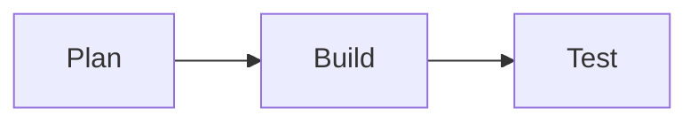

# Mermaid diagrams

Pulse Code renders Mermaid diagrams in chat when a message contains a fenced `mermaid` code block:

````markdown

````

The diagram appears after the agent finishes its turn. While the agent is writing, Pulse Code shows the source code instead of repeatedly redrawing the diagram.

Web and desktop render diagrams as SVG. Mobile renders them as PNG images. Rendering happens inside Pulse Code and does not send the diagram to an external rendering service.

If Mermaid cannot parse a diagram, or the source exceeds the rendering limit, Pulse Code leaves the source visible so you can copy or correct it.
