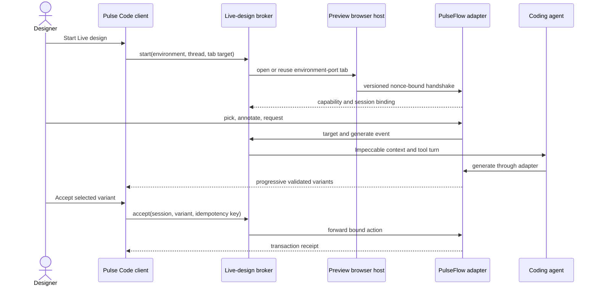

# PulseFlow Live Design Preview Host: Tool Flow

> Define the smallest Pulse Code interface that can host a PulseFlow live-design session, carry agent and page events, and preserve existing Preview behavior without learning the PulseFlow document model.

## Owning modules

- **Contracts:** `packages/contracts/src/previewLiveDesign.ts`, with additive capability, request, event, status, error, and receipt schemas.
- **Server broker:** `apps/server/src/liveDesign/PreviewLiveDesignBroker.ts`, binding environment, thread, Preview tab, page adapter, agent request, reconnect, and idempotency.
- **Preview automation bridge:** existing `apps/server/src/mcp/PreviewAutomationBroker.ts` and `apps/server/src/mcp/toolkits/preview/`, exposing optional live-design tools through the same browser host selection.
- **Shared client runtime:** `packages/client-runtime/src/state/previewLiveDesign.ts`, capability-gated and environment-scoped.
- **Web Preview:** existing `apps/web/src/components/preview/` plus a focused toolbar, page bridge, and diagnostics module.
- **Desktop:** existing browser surface remains the full local host; no PulseFlow-specific native window is added.
- **Mobile:** read-only status and handoff consume shared contracts without mounting browser controls.

The host interface exposes start, status, forward, reconcile, and stop. It hides transport selection, page message wiring, backpressure, reconnect, and browser-host identity from callers.

## Models touched

| Model                         | Fields                                                                                                                                           | Persistence                                                            |
| ----------------------------- | ------------------------------------------------------------------------------------------------------------------------------------------------ | ---------------------------------------------------------------------- |
| `PreviewLiveDesignCapability` | protocol versions, operations, transports, limits                                                                                                | Server capability snapshot.                                            |
| `PreviewLiveDesignBinding`    | environment, thread, tab, origin, nonce, session, actor, server epoch, expiry                                                                    | Server memory with bounded recovery state; no document data.           |
| `PreviewLiveDesignStatus`     | agent state, phase, target label, original/variant position, parameters, staged-copy count, progress, mount errors, queued state, recoverability | Client state scoped to one binding.                                    |
| `PreviewLiveDesignAction`     | operation, session, sequence, idempotency key, bounded payload digest                                                                            | In-flight broker record until reconciled.                              |
| `PreviewLiveDesignReceipt`    | operation, outcome, remote receipt ID, revision hints, timestamp                                                                                 | Bounded non-secret thread evidence where the user elects to retain it. |

Pulse Code stores no PulseFlow page tree, styles, prompt body, model credential, or raw generated operations.

## External services

| Service                          | Purpose                                          | Client boundary                                                                     |
| -------------------------------- | ------------------------------------------------ | ----------------------------------------------------------------------------------- |
| PulseFlow dev server and adapter | Page, picker, variants, validation, transactions | Loaded through Preview; messages cross runtime validation and binding checks.       |
| Environment-side Preview gateway | Reach a public or relay-only dev server          | Authenticated, target-bound, origin-restricted, short-lived, rate and byte limited. |
| Provider skill runtime           | Run Impeccable commands and agent tools          | Uses existing provider skill discovery and server MCP tool delivery.                |

## Background work

| Work              | Trigger                                                                       | Behavior                                                                                 |
| ----------------- | ----------------------------------------------------------------------------- | ---------------------------------------------------------------------------------------- |
| Capability probe  | Server connect or capability change                                           | Advertise the optional protocol without affecting older clients.                         |
| Page handshake    | Successful navigation or reload                                               | Create a fresh nonce and bind exact origin, tab, environment, session, and server epoch. |
| Event relay       | Valid page, agent, or user action                                             | Preserve order, enforce bounds, and forward only supported operations.                   |
| Reconciliation    | Reconnect or uncertain action                                                 | Query by idempotency key before allowing another mutation-like action.                   |
| Binding cleanup   | Navigation, origin change, tab close, transfer, epoch change, stop, or expiry | Invalidate page and agent routes and clear client state.                                 |
| Gateway keepalive | Active public remote session                                                  | Maintain bounded environment-side transport with backpressure and idle expiry.           |

## Tool and transport boundary

| Operation                          | Purpose                                                                    | Mutation class              |
| ---------------------------------- | -------------------------------------------------------------------------- | --------------------------- |
| `preview_live_design_start`        | Open or reuse the tab and establish the adapter binding                    | Host/session state only     |
| `preview_live_design_status`       | Read current phase, target, progress, variant position, and recoverability | Read-only                   |
| `preview_live_design_target`       | Forward a stable picked node                                               | Ephemeral                   |
| `preview_live_design_insert`       | Forward a schema-valid insertion anchor, position, and placeholder size    | Ephemeral                   |
| `preview_live_design_annotate`     | Forward bounded comment, stroke, and annotated screenshot evidence         | Ephemeral                   |
| `preview_live_design_prefetch`     | Ask the adapter to prepare bounded page context on first selection         | Read-only background work   |
| `preview_live_design_generate`     | Forward intent and requested count to the adapter                          | Ephemeral model work        |
| `preview_live_design_preview`      | Select original or one arrived variant                                     | Ephemeral                   |
| `preview_live_design_tune`         | Forward bounded parameter values                                           | Ephemeral                   |
| `preview_live_design_steer`        | Forward a bounded follow-up instruction                                    | Ephemeral model work        |
| `preview_live_design_stage_text`   | Stage Save or Cancel for eligible plain-text edits                         | Ephemeral                   |
| `preview_live_design_apply_text`   | Forward explicit per-page Apply with revision and idempotency guards       | Consequential remote action |
| `preview_live_design_discard_text` | Remove the current page's staged copy batch                                | Terminal ephemeral action   |
| `preview_live_design_retry_mount`  | Retry a failed variant mount while it remains invalid                      | Ephemeral                   |
| `preview_live_design_accept`       | Forward explicit user acceptance with idempotency key                      | Consequential remote action |
| `preview_live_design_discard`      | End the current set without document mutation                              | Terminal remote action      |
| `preview_live_design_stop`         | End binding and clean host state                                           | Host/session state only     |

Apply, Accept, Discard, and Rollback are not generic click proxies. Consequential actions require a current binding, exact session and target, fresh user action, revision guard, and idempotency key. PulseFlow returns the authoritative outcome.

## Happy-path sequence

## Failure modes and retries

| Failure                               | User-visible impact                             | Retry or recovery                                                                       |
| ------------------------------------- | ----------------------------------------------- | --------------------------------------------------------------------------------------- |
| Capability absent                     | Live design unavailable; Preview remains normal | Upgrade the owning server or use standalone local Impeccable.                           |
| Page handshake rejected               | Controls disabled                               | Navigate to a compatible PulseFlow route or update the adapter.                         |
| No browser host                       | Session cannot start                            | Attach a capable desktop/web host to the environment.                                   |
| Gateway required or unavailable       | Public remote target blocked                    | Start the authenticated gateway or use a directly reachable environment.                |
| Message replay, mismatch, or overflow | Event rejected                                  | Re-handshake only after reporting the typed reason; do not relax validation.            |
| Page reload                           | Brief reconnecting state                        | Fresh nonce, same valid session, checkpoint replay.                                     |
| Agent disconnect                      | Generation pauses or fails                      | Preserve page session and allow an explicit retry.                                      |
| Variant mount fails                   | Persistent invalid-variant card                 | Retry the mount or dismiss the card; do not enable Accept for the failed variant.       |
| Copy Apply fails                      | Staged intent retained                          | Offer Keep fixing or Rollback and reconcile any uncertain result before another action. |
| Accept outcome unknown                | Controls locked to reconciliation               | Query idempotency key and render the recorded outcome.                                  |
| PulseFlow denies action               | No document change                              | Display its permission, schema, or revision error and preserve intent.                  |
| Tab closes or navigates               | Session detached                                | Invalidate binding and require explicit reopen.                                         |

## Verification

Run focused contract, broker, Preview bridge, capability-skew, browser-host, desktop, web, mobile-status, gateway-security, and end-to-end PulseFlow fixture suites. Existing Preview screenshot, recording, annotation, viewport, pop-out, and automation tests remain mandatory regressions.

## Cross-references

- PRD: [PulseFlow Live Design in Pulse Code](../prd/16-pulseflow-live-design.md)
- Sitemap: [PulseFlow live-design surfaces](../sitemap/pulseflow-live-design.md)
- Workflow: [Run a PulseFlow live-design session](../workflows/run-pulseflow-live-design.md)
- Acceptance criteria: [PulseFlow live design host](../prd/20-acceptance-criteria/pulseflow-live-design.md)

## Open questions

- The gateway implementation shape and first-release web scope remain PRD decisions.

---

**Created:** 2026-09-04 . **Last opened:** 2026-09-04 . **Last edited:** 2026-09-04 . **Status:** proposed . **Owner:** Engineering . **Layer:** tactical
